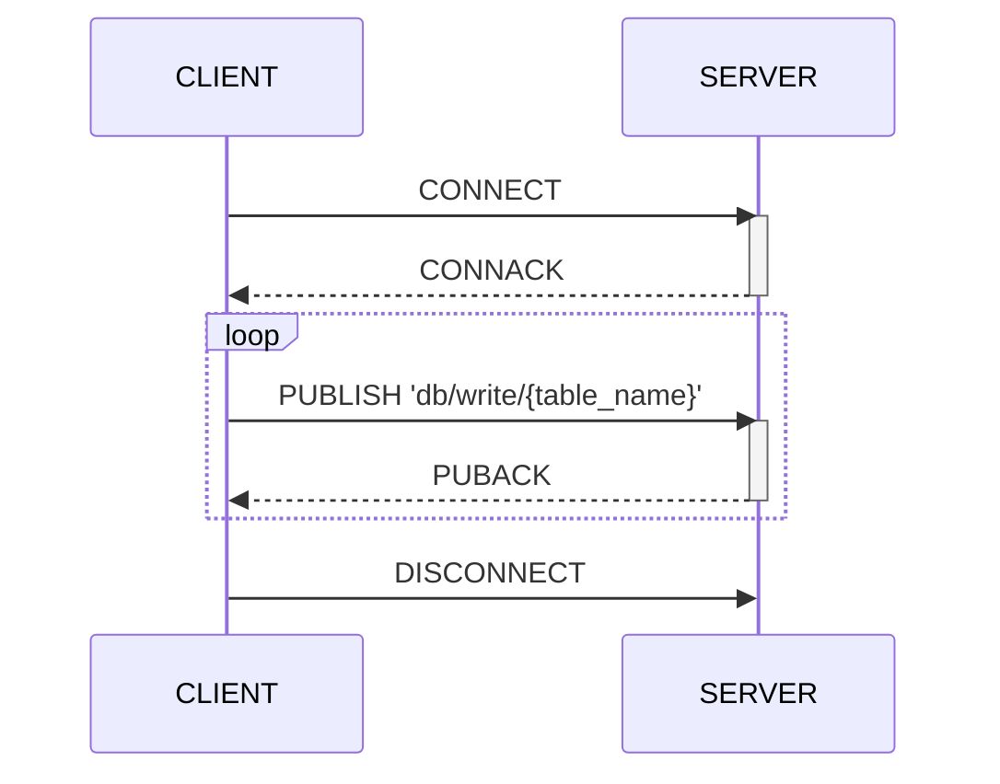
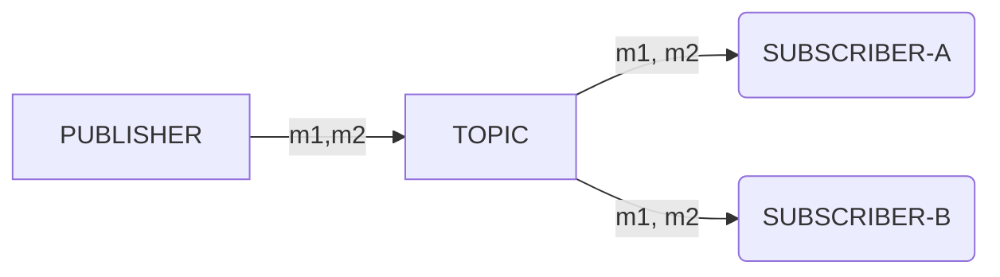
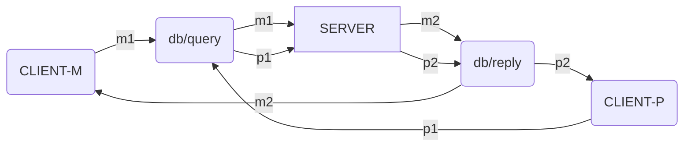
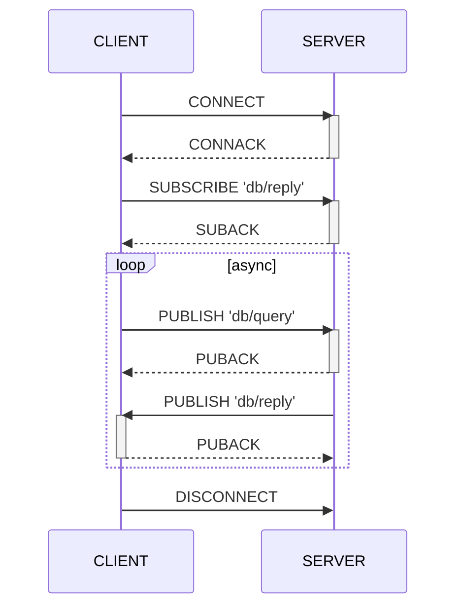

# Machbase Neo MQTT API Guide

Machbase Neo는 MQTT 프로토콜로 데이터 쓰기와 조회를 지원합니다. 

HTTP와 비교했을 때 MQTT API의 실질적인 장점은 데이터 쓰기 성능이 뛰어난 Machbase의 `append` 기능을 활용한다는 점입니다. MQTT는 연결 지향 프로토콜이라 세션 동안 연결을 유지하므로 클라이언트가 메시지를 반복해서 보내 데이터를 쓸 수 있습니다. 또한 MQTT 프로토콜은 대부분의 IoT 장비에서 널리 채택되어 있습니다.

따라서 센서가 수집한 데이터를 Machbase Neo로 보내는 가장 효율적인 방법은 MQTT입니다.

## 쓰기 flow

아래 예제는 mqtt 클라이언트(`mosquitto_pub`)로 데이터를 효율적으로 쓰는 방법을 보여 줍니다.
대상 토픽은 `db/write/`+테이블명 이어야 합니다.

## 조회 flow

일반적인 MQTT 브로커는 아래 그림처럼 토픽의 모든 구독자에게 메시지를 전달합니다. 발행자가 `TOPIC`으로 `M1`과 `M2`를 보내면 `SUBSCRIBER-A`와 `SUBSCRIBER-B`가 같은 메시지를 받습니다.

machbase-neo도 모든 메시지를 구독자에게 전달한다는 점에서 표준 MQTT 브로커와 비슷하게 동작합니다. 예외는 쿼리 응답 메시지로, 쿼리를 요청한 클라이언트에게만 전송됩니다. 즉 machbase-neo는 발행자와 구독자가 같은 연결(MQTT 용어로는 세션)을 공유할 때만 쿼리 결과를 보냅니다. 따라서 machbase-neo가 메시지 브로커로 동작하더라도 쿼리 결과 메시지는 다른 구독자에게 복제되지 않습니다.

예를 들어 `CLIENT-M`과 `CLIENT-P`가 같은 `TOPIC`을 구독하고 메시지를 기다리는 상황을 생각해 봅시다.
서버는 `CLIENT-M`에 지정된 `TOPIC`으로 메시지 `M1`과 `M2`를 보냅니다.
이 메시지들은 `CLIENT-M`에만 전달되고, `CLIENT-P`는 서버가 명시적으로 지정한 `P1`과 `P2`를 받습니다. 다른 클라이언트 `PUBLISHER-X`가 `TOPIC`으로 `X1`을 보내면 이 `X1`은 서버로 전달되며 다른 클라이언트들은 이 사건을 알지 못합니다.

MQTT로 machbase-neo에 질의하려면 애플리케이션이 먼저 `db/reply`를 구독하는 준비 단계가 필요합니다.
아래 그림은 `CLIENT`가 QoS 1을 사용한다고 가정한 일반적인 절차를 보여줍니다.
참고로 machbase-neo는 MQTT v3.1.1 규격의 QoS 0, 1을 지원합니다.

`CONNECT`와 `CONNACK`을 주고받아 MQTT 세션을 맺은 뒤, 클라이언트는 `db/query`로 쿼리 메시지를 보내기 전에 반드시 `db/reply`를 먼저 구독해야 합니다. 그렇지 않으면 "쿼리 결과"를 받을 수 없습니다.

메시지 ➍, ➎는 MQTT 프로토콜의 특성상 서버가 비동기로 보냅니다. 따라서 클라이언트 애플리케이션은 이 두 메시지의 특정 순서에 의존해 구현하면 안 됩니다.

**참고**: 데이터 쓰기를 위해 `db/append`로만 발행하는 클라이언트라면 `db/reply`를 구독할 필요가 없습니다. 이 토픽은 쿼리 결과를 받을 때만 필요합니다.
