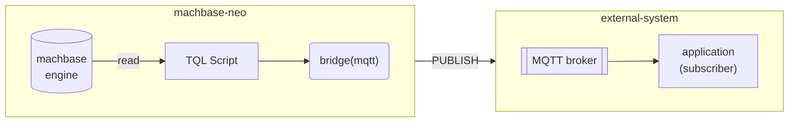
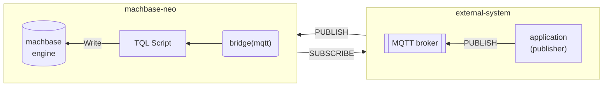
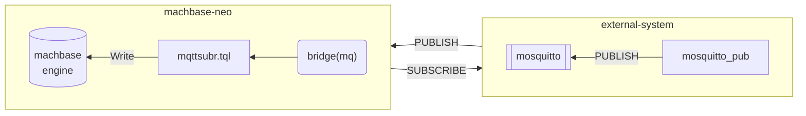

# Machbase Neo Bridge - MQTT

MQTT 브리지를 사용하면 machbase-neo가 외부 MQTT 브로커와 메시지를 주고받을 수 있습니다.

**참고**: MQTT 브리지의 장점은 기존 "MQTT 기반" 플랫폼이 machbase-neo를 도입할 때 기존 시스템을 전혀 바꾸지 않아도 된다는 점입니다.

- 외부 MQTT 브로커로 메시지 전송



- 외부 MQTT 브로커에서 메시지 수신



## 외부 MQTT 브로커 브리지 등록

브리지 등록

```
bridge add -t mqtt my_mqtt broker=127.0.0.1:1883 id=client-id;
```

MQTT 브리지는 machbase-neo가 외부 MQTT 브로커에 어떻게 접속할지만 정의합니다. 메시지를 받으려면 아래 구독자 항목을 참고하세요.

사용 가능한 연결 옵션

| 옵션           | 설명                          | 예시         |
| :-----------     | :---------------------------------   | :-------------  |
| `broker`         | 브로커 주소. 접속 지점이 여러 개면 "broker" 옵션을 여러 번 사용하세요 | `broker=192.0.1.100:1883` |
| `id`             | client id                            |                 |
| `username`       | username                             |                 |
| `password`       | password                             |                 |
| `keepalive`      | keepalive (기간 형식)         | `keepalive=30s` |
| `cleansession`   | 클린 세션                         | `cleansession=1` `cleansession=false` |
| `cafile`         | CA 인증서(`*.pem`) 파일 경로            |  *TLS*          |
| `key`            | 클라이언트 개인 키(`*.pem`) 파일 경로 |  *TLS*          |
| `cert`           | 클라이언트 인증서(`*.pem`) 파일 경로 |  *TLS*          |

`cafile`, `key`, `cert` 세 옵션을 모두 설정하면 TLS로 보안 MQTT 연결이 활성화됩니다.

## 메시지 전송

`mosquitto_sub`을 디버그 모드(`-d`) 옵션으로 실행합니다. machbase-neo가 'neo/messages' 토픽으로 메시지를 발행하면 mosquitto 브로커를 통해 이를 수신합니다.

```sh
mosquitto_sub -d -h 127.0.0.1 -p 1883 -i client-app -t neo/messages                                            1 ↵
Client client-app sending CONNECT
Client client-app received CONNACK (0)
Client client-app sending SUBSCRIBE (Mid: 1, Topic: neo/messages, QoS: 0, Options: 0x00)
Client client-app received SUBACK
Subscribed (mid: 1): 0
```

브리지의 `publish()` 함수를 호출하는 *TQL* 스크립트를 만듭니다.

**TIMER**: 이 예제는 간결함을 위해 `FAKE()`를 쓰고 수동으로 실행하지만, 브리지의 "publish" 기능은 Timer와 결합해 정해진 일정에 따라 자동으로 데이터를 보낼 때 훨씬 유용합니다.

```js
FAKE(linspace(0,10, 5))
SCRIPT("tengo", {
  ctx := import("context")
  br := ctx.bridge("my_mqtt")
  br.publish("neo/messages", "The message number is "+ctx.value(0))
  ctx.yieldKey(ctx.key(), ctx.value()...)
})
CSV()
```

위 스크립트를 실행하면 곧바로 `mosquitto_sub`이 수신한 메시지를 화면에 출력합니다.

```sh
mosquitto_sub -d -h 127.0.0.1 -p 1883 -i client-app -t neo/messages                                            1 ↵
... omit ...
Client client-app received PUBLISH (d0, q0, r0, m0, 'neo/messages', ... (23 bytes))
The message number is 0
Client client-app received PUBLISH (d0, q0, r0, m0, 'neo/messages', ... (25 bytes))
The message number is 2.5
Client client-app received PUBLISH (d0, q0, r0, m0, 'neo/messages', ... (23 bytes))
The message number is 5
Client client-app received PUBLISH (d0, q0, r0, m0, 'neo/messages', ... (25 bytes))
The message number is 7.5
Client client-app received PUBLISH (d0, q0, r0, m0, 'neo/messages', ... (24 bytes))
The message number is 10
```

## 메시지 수신 - 구독자

브리지와 구독자를 활용해 MQTT 브로커에서 메시지를 받아 데이터베이스에 저장하는 예제를 만들어 봅시다.

이 시연에서는 MQTT 브로커로 `mosquitto`를, MQTT 클라이언트로 `mosquitto_pub`을 사용합니다. 이 도구들이 "외부" 시스템을 흉내 냅니다.



### 1. MQTT 브로커 실행

machbase-neo의 MQTT 브리지는 MQTT v3.1.1 사양과 호환되는 모든 MQTT 브로커에서 동작합니다.

설치된 MQTT 브로커가 없다면 데모용으로 *mosquitto*를 받아 실행하세요. https://mosquitto.org

```sh
$ mosquitto -p 1883

1691466522: mosquitto version 2.0.15 starting
1691466522: Using default config.
1691466522: Starting in local only mode. Connections will only be possible from clients running on this machine.
1691466522: Create a configuration file which defines a listener to allow remote access.
1691466522: For more details see https://mosquitto.org/documentation/authentication-methods/
1691466522: Opening ipv4 listen socket on port 1883.
1691466522: Opening ipv6 listen socket on port 1883.
1691466522: mosquitto version 2.0.15 running
```

### 2. 브리지 등록

machbase-neo 셸을 열고 `bridge add...` 명령을 실행합니다.

```
bridge add -t mqtt my_mqtt broker=127.0.0.1:1883 id=demo;
```

machbase-neo가 지정한 브로커에 접속하는 방법을 정의합니다.

```
machbase-neo» bridge list;
╭─────────┬──────────┬─────────────────────────────────╮
│ NAME    │ TYPE     │ CONNECTION                      │
├─────────┼──────────┼─────────────────────────────────┤
│ my_mqtt │ mqtt     │ broker=127.0.0.1:1883 id=demo   │
╰─────────┴──────────┴─────────────────────────────────╯
```

브리지 `my_mqtt`가 정상 등록되면 machbase-neo가 브로커에 접속하고 mosquitto가 아래와 같은 연결 로그를 보여줍니다.

네트워크 문제가 있거나 브로커가 다운되면 machbase-neo가 주기적으로 재연결을 시도해 브리지를 최대한 사용 가능한 상태로 유지합니다.

```
1691466529: New connection from 127.0.0.1:65440 on port 1883.
1691466529: New client connected from 127.0.0.1:65440 as demo (p2, c1, k30).
```

### 3-A. 쓰기 서술자를 사용하는 구독자

machbase-neo 셸을 열어 브리지와 데이터베이스 테이블을 잇는 새 구독자를 추가합니다.

```
subscriber add --autostart mqtt_subr my_mqtt iot/sensor db/append/EXAMPLE:csv;
```

`subscriber list`를 실행해 등록을 확인합니다.

```
┌───────────┬─────────┬────────────┬───────────────────────┬───────────┬─────────┐
│ NAME      │ BRIDGE  │ TOPIC      │ DESTINATION           │ AUTOSTART │ STATE   │
├───────────┼─────────┼────────────┼───────────────────────┼───────────┼─────────┤
│ MQTT_SUBR │ my_mqtt │ iot/sensor │ db/append/EXAMPLE:csv │ true      │ RUNNING │
└───────────┴─────────┴────────────┴───────────────────────┴───────────┴─────────┘
```

다음을 지정합니다...
- `--autostart`는 machbase-neo와 함께 구독자를 시작합니다. 수동으로 시작·중지하려면 생략하세요.
- `mqtt_subr` 구독자의 이름입니다.
- `my_mqtt` 구독자가 사용할 브리지의 이름입니다.
- `iot/sensor` 구독할 토픽입니다. MQTT 토픽 문법을 따라야 합니다.
- `db/append/EXAMPLE:csv` 쓰기 서술자입니다. 들어오는 데이터가 CSV 형식이고 `EXAMPLE` 테이블에 *append* 모드로 쓴다는 뜻입니다.

쓰기 서술자 자리에 *TQL* 스크립트 파일 경로를 대신 넣을 수 있습니다. 예제는 뒤에서 다룹니다.

쓰기 서술자의 문법은 다음과 같습니다 ...

```
db/{method}/{table_name}:{format}:{compress}?{options}
```

**method**

`append`와 `write` 두 가지 방식이 있습니다. MQTT 같은 스트림 환경에서는 `append`를 권장합니다.

- `append` append 모드로 데이터를 씁니다
- `write` INSERT SQL 문으로 데이터를 씁니다

**table_name**

대상 테이블 이름을 지정합니다. 대소문자를 구분하지 않습니다.

**format**

- `json` (default)
- `csv`

**compress**

현재 `gzip`을 지원합니다. `:{compress}` 부분을 생략하면 데이터가 압축되지 않았다는 뜻입니다.

**options**

쓰기 서술자에는 물음표로 구분된 URL 인코딩 파라미터를 선택적으로 넣을 수 있습니다.

| 이름          | 기본값      | 설명                                                    |
| :------------ | :----------- | :------------------------------------------------------------- |
| `timeformat`  | `ns`         | 시간 형식: s, ms, us, ns                                     |
| `tz`          | `UTC`        | 시간대: UTC, Local, 지역 지정                        |
| `delimiter`   | `,`          | CSV 구분자. 내용이 CSV가 아니면 무시됩니다                   |
| `heading`     | `false`      | CSV에 헤더 줄이 있으면 `true`로 두어 첫 줄을 건너뜁니다 |

- `db/append/EXAMPLE:csv?timeformat=s&heading=true`
- `db/write/EXAMPLE:csv:gzip?timeformat=s`

#### `mosquitto_pub`으로 메시지 전송

아래와 같이 데이터 파일 `data.csv`를 만듭니다.

```csv
mqtt-demo.temp,1691470297923000000,34.1
mqtt-demo.humidity,1691470297923000000,67.8
``` 

`mosquitto_pub`으로 `data.csv`를 MQTT 브로커에 발행합니다.

```sh
mosquitto_pub -d -h 127.0.0.1 -p 1883 -t iot/sensor -f data.csv
```

저장된 데이터를 조회합니다.

```sh
machbase-neo» select * from example where name in ('mqtt-demo.temp', 'mqtt-demo.humidity');
╭────────┬────────────────────┬─────────────────────────┬───────────╮
│ ROWNUM │ NAME               │ TIME(LOCAL)             │ VALUE     │
├────────┼────────────────────┼─────────────────────────┼───────────┤
│      1 │ mqtt-demo.temp     │ 2023-08-08 13:51:37.923 │ 34.100000 │
│      2 │ mqtt-demo.humidity │ 2023-08-08 13:51:37.923 │ 67.800000 │
╰────────┴────────────────────┴─────────────────────────┴───────────╯
```

### 3-B. TQL을 사용하는 구독자

#### 데이터 쓰기 TQL 스크립트

machbase-neo *TQL* 에디터를 열고 아래 코드를 붙여넣어 `mqttsubr.tql`로 저장합니다.

```js
CSV(payload())
MAPVALUE(1, parseTime(value(1), "ns"))
MAPVALUE(2, parseFloat(value(2)))
APPEND( table("example") )
```

machbase-neo 셸을 열어 브리지와 TQL 스크립트를 잇는 새 구독자를 추가합니다.

```sh
subscriber add --autostart --qos 1 mqttsubr my_mqtt iot/sensor /mqttsubr.tql;
```

다음을 지정합니다 ...
- `--autostart`는 machbase-neo와 함께 구독자를 시작합니다
- `--qos 1` QoS 1로 토픽을 구독합니다. MQTT 브리지는 QoS 0과 1을 지원합니다
- `mqttsubr` 구독자 이름
- `my_mqtt` 구독자가 사용할 브리지 이름
- `iot/sensor` 구독할 토픽 이름입니다. `#`와 `+`를 포함한 표준 MQTT 토픽 문법을 지원합니다

`--autostart` 옵션으로 등록했으므로 새로 등록한 구독자가 `RUNNING` 상태인지 확인합니다.

```
machbase-neo» subscriber list;
╭──────────┬─────────┬────────────┬───────────────┬───────────┬─────────╮
│ NAME     │ BRIDGE  │ TOPIC      │ TQL           │ AUTOSTART │ STATE   │
├──────────┼─────────┼────────────┼───────────────┼───────────┼─────────┤
│ MQTTSUBR │ my_mqtt │ iot/sensor │ /mqttsubr.tql │ true      │ RUNNING │
╰──────────┴─────────┴────────────┴───────────────┴───────────┴─────────╯
```

#### `mosquitto_pub`으로 메시지 전송

아래와 같이 데이터 파일 `data.csv`를 만듭니다.

```csv
mqtt-demo.temp,1691470297923000000,34.1
mqtt-demo.humidity,1691470297923000000,67.8
``` 

`mosquitto_pub`으로 `data.csv`를 MQTT 브로커에 발행합니다.

```sh
mosquitto_pub -d -h 127.0.0.1 -p 1883 -t iot/sensor -f data.csv
```

저장된 데이터를 조회합니다.

```sh
machbase-neo» select * from example where name in ('mqtt-demo.temp', 'mqtt-demo.humidity');
╭────────┬────────────────────┬─────────────────────────┬───────────╮
│ ROWNUM │ NAME               │ TIME(LOCAL)             │ VALUE     │
├────────┼────────────────────┼─────────────────────────┼───────────┤
│      1 │ mqtt-demo.temp     │ 2023-08-08 13:51:37.923 │ 34.100000 │
│      2 │ mqtt-demo.humidity │ 2023-08-08 13:51:37.923 │ 67.800000 │
╰────────┴────────────────────┴─────────────────────────┴───────────╯
```
