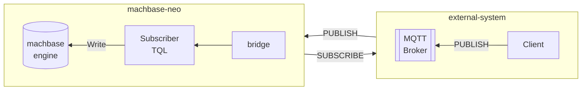

# Machbase Neo Bridge and Subscriber

## Bridge

### 브리지 등록

sqlite 연결 등록

```
bridge add -t sqlite sqlitedb file:/data/sqlite.db;
```

### 등록된 브리지 목록

```
bridge list
┌──────────┬────────┬────────────────────────┐
│ NAME     │ TYPE   │ CONNECTION             │
├──────────┼────────┼────────────────────────┤
│ sqlitedb │ sqlite │ file:/data/sqlite.db   │
└──────────┴────────┴────────────────────────┘
```

### 브리지에서 명령 실행

```
bridge exec sqlitedb CREATE TABLE IF NOT EXISTS example(id INTEGER NOT NULL PRIMARY KEY, name TEXT, age TEXT, address TEXT, UNIQUE(name));
```

### 브리지에서 query 명령

`bridge query` 명령은 "SQL" 타입 브리지에서만 동작합니다

```
bridge query sqlitedb select * from example;

┌────┬────────┬─────┬───────────────┐
│ ID │ NAME   │ AGE │ ADDRESS       │
├────┼────────┼─────┼───────────────┤
│  1 │ hong_1 │ 20  │ address for 1 │
│  2 │ hong_2 │ 20  │ address for 2 │
│  3 │ hong_3 │ 20  │ address for 3 │
└────┴────────┴─────┴───────────────┘
```

### *tql*의 `SQL()`로 브리지 활용

`SQL()`은 "SQL" 타입 브리지와 함께 `bridge()` 옵션을 받아 주어진 SQL 문을 실행합니다.

```js
SQL(bridge("sqlitedb"), `select * from example`)
CSV()
```

### *tql* `SCRIPT()`에서 브리지 활용

아래 예제처럼 `SCRIPT()`에서 `$.db({bridge:"name"})`로 데이터베이스 타입 브리지에 접근할 수 있습니다.

JavaScript에서 `$.db({bridge:"name"})`로 브리지 데이터베이스에 접근하는 기능은 버전 8.0.27부터 지원됩니다.

```js
SCRIPT({
    err = $.db({bridge:"mem"})
     .query("select company, employee, created_on from mem_example")
     .forEach( function(fields){
        $.yield(fields[0], fields[1], fields[2]);
     })
    if (err !== undefined) {
        console.error("result", ret);
    }
})
CSV()
```

### 다른 데이터베이스로 데이터 복사

이 예제는 Machbase에서 SQLite 브리지로 데이터를 복사하는 방법을 보여줍니다.

**Bridge**

다음 내용으로 `sqlite` 브리지를 정의합니다:

- Type: `SQLite`
- 연결 문자열: `file:///tmp/sqlite.db`

**SQL**

"/tmp/sqlite.db"에 있는 SQLite 데이터베이스에 `example` 테이블을 만듭니다.

```sql
--env: bridge=sqlite
CREATE TABLE IF NOT EXISTS example (
    NAME TEXT,
    TIME DATETIME,
    VALUE REAL
);
-- env: reset
```

**TQL**

아래 TQL 스크립트는 `SQL()` 함수로 `SELECT` 문을 실행해 필요한 데이터를 가져온 뒤, 첫 인자로 `bridge("sqlite")`를 준 `INSERT()` 함수로 SQLite 데이터베이스에 씁니다.

```js
SQL(`select name, time, value from example where name = 'my-car'`)
INSERT(bridge("sqlite"), "name", "time", "value", table("example"))
```

## Subscriber

*구독자*의 목적은 외부 메시지 브로커 시스템에 접속해 스트리밍 메시지를 받고 *tql* 스크립트로 적재하는 것입니다.

현재 machbase-neo는 외부 MQTT 브로커 연결을 지원하며, 향후 릴리스에서 NATS와 Kafka도 지원할 예정입니다.

간단한 사용 사례는 외부 MQTT 브로커로 브리지를 만들고, 1) 브리지, 2) MQTT 브로커의 토픽, 3) *tql* 스크립트 경로로 구독자를 정의하는 것입니다. 그러면 machbase-neo가 MQTT 클라이언트로 동작하며 메시지를 받을 때마다 지정한 *tql* 스크립트로 전달합니다.



### 구독자 등록

구독자를 등록합니다.

**Syntax:** `subscriber add [options] <name> <bridge> <topic> <tql-path>`

- options
    - `--autostart`는 machbase-neo가 시작될 때 구독자를 자동으로 시작합니다. *autostart* 모드가 아니면 `subscriber start <name>`, `subscriber stop <name>` 명령으로 수동 시작·중지할 수 있습니다.
    - `--qos <int>` 브리지가 MQTT 타입이면 토픽 구독의 QoS 수준을 지정합니다. `0`, `1`을 지원하며 지정하지 않으면 기본값은 `0`입니다.
    - `--queue <string>` 브리지가 NATS 타입이면 Queue Group을 지정합니다.

- `<name>` 구독자 이름
- `<bridge>` 미리 정의된 브리지를 지정합니다. 브로커 타입이어야 합니다
- `<topic>` 구독할 토픽
- `<tql-path>` 수신 메시지를 처리할 *tql* 스크립트

### 구독자 상태

**Syntax:** `subscriber list`

- `STOP`
- `RUNNING`

### 구독자 시작/중지

**Syntax:** `subscriber [start | stop] <name>`

### 구독자 제거

**Syntax:** `subscriber del <name>`
