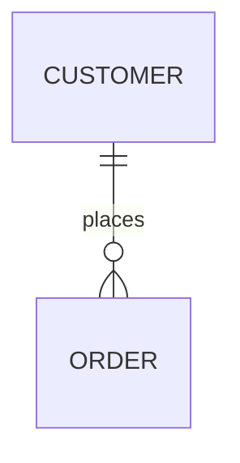

# Machbase Neo TQL Guide

## What is TQL?

Machbase Neo는 TQL(Transforming Query Language)과 실행 API를 지원합니다.

애플리케이션 개발자는 데이터베이스를 사용하는 애플리케이션을 만들 때 대체로 비슷한 과정을 거칩니다. 데이터베이스에 질의해 표 형태(행과 열)로 데이터를 가져오고, 이를 원하는 자료구조로 변환·가공한 뒤 JSON, CSV, 차트 같은 형식으로 표시합니다.

TQL은 이 과정을 스크립트 몇 줄로 단순화합니다. 또한 다른 애플리케이션이 HTTP 엔드포인트로 TQL을 호출해 실행 가능한 API처럼 쓸 수 있습니다.

## TQL 개념

TQL(Transforming Query Language)은 데이터 가공을 위한 도메인 특화 언어(DSL)입니다. 데이터 스트림의 흐름을 정의하며, 각 데이터 단위는 레코드입니다. 레코드는 키와 값을 가집니다. 키는 보통 쿼리 결과의 ROWNUM처럼 자동 생성되는 순차 정수이고, 값은 실제 데이터 필드를 담은 튜플입니다.

TQL 스크립트는 데이터를 가져와 원시 데이터를 레코드로 변환하는 SRC(소스) 함수로 시작합니다. 그리고 레코드를 어떻게 출력할지 정의하는 SINK 함수로 끝납니다. SRC와 SINK 사이에는 필요에 따라 MAP 함수로 데이터를 변환할 수 있습니다.

경우에 따라 TQL 스크립트는 수학 계산, 단순 문자열 연결, 외부 데이터베이스 연동 등으로 레코드를 변환해야 합니다. 이런 작업은 MAP 함수로 정의할 수 있습니다.

즉 TQL 스크립트는 SRC 함수로 시작해 SINK 함수로 끝나야 하며, 그 사이에 필요한 변환을 위한 MAP 함수를 0개 이상 넣을 수 있습니다.

### SRC 함수

TQL에는 여러 SRC 함수가 있습니다. 예를 들어 `SQL()` 함수는 주어진 SQL 문으로 Machbase Neo 데이터베이스나 외부(브리지) 데이터베이스에 질의해 레코드를 만듭니다. `FAKE()` 함수는 테스트용 인공 데이터를 생성합니다. `CSV()` 함수는 CSV 파일에서 데이터를 읽고, `BYTES()` 함수는 파일 시스템·클라이언트 HTTP 요청·MQTT 페이로드에서 임의의 이진 데이터를 읽습니다.

### SINK 함수

기본 SINK 함수로는 들어온 레코드를 Machbase Neo 데이터베이스에 쓰는 `INSERT()`, 들어온 레코드로 차트를 그리는 `CHART()`가 있습니다. 그 밖에 `JSON()`과 `CSV()` 함수는 들어온 데이터를 각 형식으로 인코딩해 다른 애플리케이션과 연동하거나 보기 좋게 표시할 수 있게 합니다.

### MAP 함수

MAP 함수는 데이터의 형태를 바꾸는 데 핵심적인 역할을 합니다. 수학 계산, 문자열 조작, 데이터 형식 변환 등 다양한 연산을 수행할 수 있습니다. MAP 함수를 사용하면 애플리케이션의 요구에 맞게 데이터를 효율적으로 가공하고 재구성할 수 있습니다.

## 태그 원시 리터럴

여러 줄 문자열 안에 백틱이나 중괄호(`{`, `}`)가 들어 있으면 경계 충돌을 피하기 위해 태그 원시 리터럴을 사용합니다. 두 가지 형태가 있으며, 둘 다 본문을 원시 텍스트로 취급하고 태그가 붙은 닫는 줄에서 종료됩니다:

- 태그 백틱: `` `<<TAG ... TAG` ``
- 태그 중괄호 블록: `{<<TAG ... TAG}`

아래 예제는 중괄호가 포함된 JavaScript를 삽입합니다:

```js
SCRIPT(`<<JS
// this is a function return '{'
function a () { return '{' }
JS`)
CSV()
```

태그 중괄호 형태를 쓰면 마크다운 내용 안에 자체 코드펜스를 넣을 수 있습니다:

~~~js
MARKDOWN({<<MD

MD})
~~~

## 출력 형식 독립성

같은 데이터 소스에서 다양한 출력 형식을 만들 수 있습니다:

**CSV Format:**
```js
SQL( `SELECT TIME, VALUE FROM EXAMPLE WHERE NAME='signal' LIMIT 100` )
CSV( timeformat("Default") )
```

**JSON Format:**
```js
SQL( `SELECT TIME, VALUE FROM EXAMPLE WHERE NAME='signal' LIMIT 100` )
JSON( timeformat("Default") )
```

**CHART 형식:**
```js
SQL( `SELECT TIME, VALUE FROM EXAMPLE WHERE NAME='signal' LIMIT 100` )
CHART(
    size("600px", "340px"),
    chartOption({
        xAxis:{data:column(0)},
        yAxis:{},
        series:[ { type:"line", data:column(1)} ]
    })
)
```

**HTML Format:**
```html
SQL(`SELECT TIME, VALUE FROM EXAMPLE WHERE NAME='signal' LIMIT 100`)
HTML({
  {{if .IsFirst }}
    <table>
    <tr>
        <th>TIME</th><th>VALUE</th>
    </tr>
  {{end}}
    <tr>
        <td>{{.V.TIME}}</td><td>{{.V.VALUE}}</td>
    </tr>
  {{if .IsLast }}
    </table>
  {{end}}
})
```

## 데이터 소스 독립성

같은 변환 로직을 다양한 데이터 소스에 적용할 수 있습니다:

**JSON Data:**
```js
FAKE( json({ 
    [ "A", 1.0 ],
    [ "B", 1.5 ],
    [ "C", 2.0 ],
    [ "D", 2.5 ] }))

MAPVALUE(1, value(1) * 10 )

CSV()
```

**CSV Data:**
```js
CSV(`A,1.0
B,1.5
C,2.0
D,2.5`, field(1, floatType(), "value"))

MAPVALUE(1, value(1) * 10 )

CSV()
```

**SQL Query:**
```js
SQL(`select time, value from example where name = 'my-car' limit 4`)

MAPVALUE(1, value(1) * 10 )

CSV()
```

**Script - JSON 파싱:**
```js
SCRIPT({
    list = JSON.parse(`[["A",1.0], ["B",1.5], ["C",2.0], ["D",2.5]]`);
    for( v of list) {
        $.yield(v[0], v[1])
    }
})
MAPVALUE(1, value(1) * 10 )
CSV()
```

**Script - For 반복문:**
```js
SCRIPT({
    for (i = 0; i < 10; i++) {
        $.yield("script", Math.random())
    }
})

MAPVALUE(1, value(1) * 10 )

CSV()
```

TQL의 목적은 데이터 형식을 변환하는 것입니다. 이 장에서는 별도의 애플리케이션 개발 없이 이를 처리하는 방법을 보여줍니다.

## N:M 변환

(원문의 N:M 변환 관련 내용이 이 자리에 들어갑니다)

## 붓꽃 데이터셋 예제

아래 TQL 예제 코드로 TQL이 무엇을 위한 것인지 간단히 확인할 수 있습니다.

### 평균값

각 클래스의 평균값을 계산합니다:

```js
CSV(file("https://docs.machbase.com/assets/example/iris.csv"))
GROUP( by(value(4), "species"),
    avg(value(0), "Avg. Sepal L."),
    avg(value(1), "Avg. Sepal W."),
    avg(value(2), "Avg. Petal L."),
    avg(value(3), "Avg. Petal W.")
)
CHART(
    chartOption({
        "xAxis":{"type": "category", "data": column(0)},
        "yAxis": {},
        "legend": {"show": true},
        "series": [
            { "type": "bar", "name": "Avg. Sepal L.", "data": column(1)},
            { "type": "bar", "name": "Avg. Sepal W.", "data": column(2)},
            { "type": "bar", "name": "Avg. Petal L.", "data": column(3)},
            { "type": "bar", "name": "Avg. Petal W.", "data": column(4)}
        ]
    })
)
```

### 통계 분석

setosa 클래스 꽃받침 길이의 최솟값·중앙값·평균·최댓값·표준편차를 계산합니다:

```js
CSV(file("https://docs.machbase.com/assets/example/iris.csv"))
FILTER( strToUpper(value(4)) == "IRIS-SETOSA")
GROUP( by(value(4)), 
    min(value(0), "Min"),
    median(value(0), "Median"),
    avg(value(0), "Avg"),
    max(value(0), "Max"),
    stddev(value(0), "StdDev.")
)
CHART(
    chartOption({
        "xAxis": { "type": "category", "data": ["iris-setosa"]},
        "yAxis": {},
        "legend": {"show": "true"},
        "series": [
            {"type":"bar", "name": "Min", "data": column(1)},
            {"type":"bar", "name": "Median", "data": column(2)},
            {"type":"bar", "name": "Avg", "data": column(3)},
            {"type":"bar", "name": "Max", "data": column(4)},
            {"type":"bar", "name": "StdDev.", "data": column(5)}
        ]
    })
)
```

### Script를 사용한 막대 차트

```js
CSV(file("https://docs.machbase.com/assets/example/iris.csv"))
SCRIPT({
    var board = {};
},{
    species = $.values[4];
    o = board[species];
    if(o === undefined) {
        o = {
            sepalLength: [],
            sepalWidth: [],
            petalLength: [],
            petalWidth: [],
        };
        board[species] = o;
    }
    o.sepalLength.push(parseFloat($.values[0]));
    o.sepalWidth.push(parseFloat($.values[1]));
    o.petalLength.push(parseFloat($.values[2]));
    o.petalWidth.push(parseFloat($.values[3]))
},{
    chart = {
        xAxis: {type: "category", data:[]},
        yAxis: {},
        legend: {show:true},
        series: [
            {type: "bar", name: "min. sepal L.", data:[]},
            {type: "bar", name: "max. sepal L.", data:[]},
            {type: "bar", name: "min. sepal W.", data:[]},
            {type: "bar", name: "max. sepal W.", data:[]},
            {type: "bar", name: "min. petal L.", data:[]},
            {type: "bar", name: "max. petal L.", data:[]},
            {type: "bar", name: "min. petal W.", data:[]},
            {type: "bar", name: "max. petal W.", data:[]},
        ],
    };
    for( s in board) {
        o = board[s];
        chart.xAxis.data.push(s);
        chart.series[0].data.push(Math.min(...o.sepalLength));
        chart.series[1].data.push(Math.max(...o.sepalLength));
        chart.series[2].data.push(Math.min(...o.sepalWidth));
        chart.series[3].data.push(Math.max(...o.sepalWidth));
        chart.series[4].data.push(Math.min(...o.petalLength));
        chart.series[5].data.push(Math.max(...o.petalLength));
        chart.series[6].data.push(Math.min(...o.petalWidth));
        chart.series[7].data.push(Math.max(...o.petalWidth));
    }
    $.yield(chart);
})
CHART()
```

### Script를 사용한 박스플롯

```js
CSV(file("https://docs.machbase.com/assets/example/iris.csv"))
SCRIPT({
    var board = {};
},{
    species = $.values[4];
    o = board[species];
    if(o === undefined) {
        o = {
            sepalLength: [],
            sepalWidth: [],
            petalLength: [],
            petalWidth: [],
        };
        board[species] = o;
    }
    o.sepalLength.push(parseFloat($.values[0]));
    o.sepalWidth.push(parseFloat($.values[1]));
    o.petalLength.push(parseFloat($.values[2]));
    o.petalWidth.push(parseFloat($.values[3]))
},{
    chart = {
        title: {text: "Iris Sepal/Petal Length", left: "center"},
        grid: {bottom: "10%"},
        xAxis: {type: "category", data:[], boundaryGap: true},
        yAxis: {type: "value", splitArea:{show:true}},
        legend: {show:true, bottom:"2%"},
        tooltip: {trigger: "item", axisPointer:{type:"shadow"}},
        series: [
            {type: "boxplot", name: "sepal length", data:[]},
            {type: "boxplot", name: "petal length", data:[]},
        ],
    };
    const ana = require("@jsh/analysis");
    for( s in board) {
        o = board[s];
        chart.xAxis.data.push(s);
        // sepal length
        o.sepalLength = ana.sort(o.sepalLength)
        min = Math.min(...o.sepalLength);
        max = Math.max(...o.sepalLength);
        q1 = ana.quantile(0.25, o.sepalLength);
        q2 = ana.quantile(0.5, o.sepalLength);
        q3 = ana.quantile(0.75, o.sepalLength);
        chart.series[0].data.push([min, q1, q2, q3, max]);
        // petal length
        o.petalLength = ana.sort(o.petalLength)
        min = Math.min(...o.petalLength);
        max = Math.max(...o.petalLength);
        q1 = ana.quantile(0.25, o.petalLength);
        q2 = ana.quantile(0.5, o.petalLength);
        q3 = ana.quantile(0.75, o.petalLength);
        chart.series[1].data.push([min, q1, q2, q3, max]);
    }
    $.yield(chart);
})
CHART()
```

## Running TQL

### 1단계: 웹 UI 열기

웹 브라우저에서 Machbase Neo 웹 UI를 엽니다. 기본 주소는 `http://127.0.0.1:5654/` 이며, 사용자 이름은 `sys`, 비밀번호는 `manager`입니다.

### 2단계: 새 TQL 페이지

'New...' 페이지에서 "TQL"을 선택합니다.

### 3단계: 코드 붙여넣고 실행

샘플 TQL 코드를 TQL 에디터에 붙여넣습니다.

그리고 에디터 좌측 상단의 ▶︎ 아이콘을 클릭합니다. 아래 이미지처럼 주파수 1.5Hz, 진폭 1.0의 파형을 나타내는 선 차트가 표시됩니다.

**SCATTER 차트:**
```js
FAKE( oscillator(freq(1.5, 1.0), range('now', '3s', '10ms')) )
CHART_SCATTER()
```

**LINE Chart:**
```js
FAKE( oscillator(freq(1.5, 1.0), range('now', '3s', '10ms')) )
CHART_LINE()
```

**BAR Chart:**
```js
FAKE( oscillator(freq(1.5, 1.0), range('now', '3s', '10ms')) )
CHART_BAR()
```

### 데이터 형식 살펴보기

CSV와 JSON 같은 데이터 형식을 살펴봅시다.

- **CSV 형식**: 스프레드시트나 CSV를 지원하는 다른 애플리케이션으로 데이터를 내보낼 때 유용합니다.
- **JSON 형식**: 파싱이 쉽고 JavaScript와 잘 맞아 웹 애플리케이션과 API에 적합합니다.

TQL을 사용하면 코드 몇 줄로 데이터를 이러한 형식으로 손쉽게 변환할 수 있습니다.

**JSON - Rows 형식:**
```js
FAKE( oscillator(freq(1.5, 1.0), range('now', '3s', '10ms')) )
JSON()
```

**JSON - Columns 형식:**
```js
FAKE( oscillator(freq(1.5, 1.0), range('now', '3s', '10ms')) )
JSON( transpose(true) )
```

**CSV Format:**
```js
FAKE( oscillator(freq(1.5, 1.0), range('now', '3s', '10ms')) )
CSV()
```

**MARKDOWN 형식:**
```js
FAKE( oscillator(freq(1.5, 1.0), range('now', '3s', '10ms')) )
MARKDOWN()
```

**HTML Format:**
```js
FAKE( oscillator(freq(1.5, 1.0), range('now', '3s', '10ms')) )
MARKDOWN( html(true) )
```

## TQL as API

에디터 우측 상단의 저장 아이콘을 클릭해 이 코드를 `hello.tql`로 저장합니다. 그러면 웹 브라우저에서 http://127.0.0.1:5654/db/tql/hello.tql 로 접근하거나, 터미널에서 curl 명령으로 데이터를 가져올 수 있습니다.

> TQL 스크립트를 저장하면 에디터 우측 상단에 링크 아이콘이 표시됩니다. 이 아이콘을 클릭하면 스크립트 파일의 주소가 복사됩니다.

```sh
curl -o - http://127.0.0.1:5654/db/tql/hello.tql
```

실행 결과:
```sh
$ curl -o - -v http://127.0.0.1:5654/db/tql/hello.tql
...omit...
>
< HTTP/1.1 200 OK
< Content-Type: text/csv
< Transfer-Encoding: chunked
<
1686787739025518000,-0.238191
1686787739035518000,-0.328532
1686787739045518000,-0.415960
1686787739055518000,-0.499692
1686787739065518000,-0.578992
...omit...
```

### JSON Output

`CSV()`를 `JSON()`으로 바꾸고 저장한 뒤 다시 실행해 봅시다.

그리고 터미널에서 curl로 hello.tql을 호출합니다:
```sh
$ curl -o - -v http://127.0.0.1:5654/db/tql/hello.tql
...omit...
< HTTP/1.1 200 OK
< Content-Type: application/json
< Transfer-Encoding: chunked
<
{
"data": {
    "columns": [ "time", "value" ],
    "types": [ "datetime", "double" ],
    "rows": [
    [ 1686788907538618000, 0.9344920354538058 ],
    [ 1686788907548618000, 0.8968436523101743 ],
    ...omit...
},
"success": true,
"reason": "success",
"elapse": "956.291µs"
}
```

### transpose()를 사용한 JSON

데이터 시각화 애플리케이션을 개발한다면, TQL의 JSON 출력이 결과를 행 대신 열로 전치할 수 있다는 점이 유용합니다. `JSON( transpose(true) )`를 적용해 다시 호출하면 결과 JSON에 `cols` 배열이 담깁니다.

```sh
$ curl -o - -v http://127.0.0.1:5654/db/tql/hello.tql
...omit...
< HTTP/1.1 200 OK
< Content-Type: application/json
< Transfer-Encoding: chunked
<
{
"data": {
    "columns": [ "time", "value" ],
    "types": [ "datetime", "double" ],
    "cols": [
        [ 1686789517241103000, ...omit..., 1686789520231103000],
        [ -0.7638449771082523, ...omit..., 0.8211935584502427]
    ]
},
"success": true,
"reason": "success",
"elapse": "1.208166ms"
}
```

이 기능은 개발자가 RESTful API를 만드는 가장 간단한 방법이며, 다른 애플리케이션이 데이터에 자연스럽게 접근할 수 있게 합니다.

### INSERT Data

`CSV()`를 `INSERT("time", "value", table("example"), tag("temperature"))` 로 바꾸고 다시 실행합니다.

### 테이블 조회

```js
SQL('select * from tag limit 10')
CSV()
```
